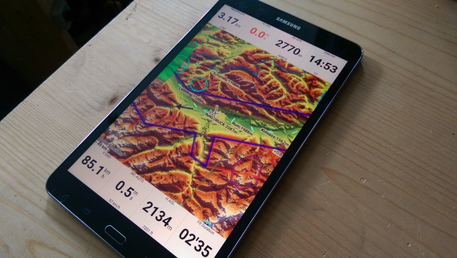
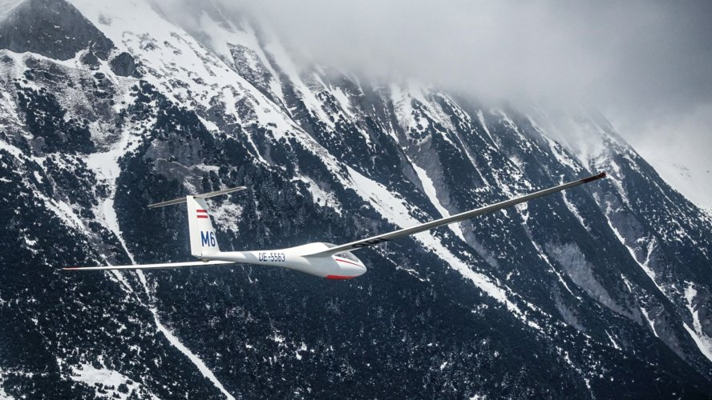

# XCSoarAlps
A beautiful XCSoar configuration for flying in the Alps.

All airspace and waypoint data is CC [BY-NC-SA](http://creativecommons.org/licenses/by-nc-sa/3.0/) licensed.

Airport waypoints and airspaces are from [OpenAIP](http://www.openaip.net) and cleaned up to avoid redundant definitions.

HOW TO USE THIS
---------------
- Install XCSoar on your Android device (v7, xcsoar-testing as of April 2016).
- [Download](https://github.com/stefanix/XCSoarAlps/archive/master.zip) and copy the entire XCSoarData folder to the internal storage of your Android device (typically /storage/emulated/0/).
- Then start up XCSoar and configure pilot name, home airport, and your plane.

DISCLAIMER
----------
All this date may have errors in them. Do not relay on it without double-checking its accuracy. The author does not warrant any correctness nor usefulness of this data and configuration.

